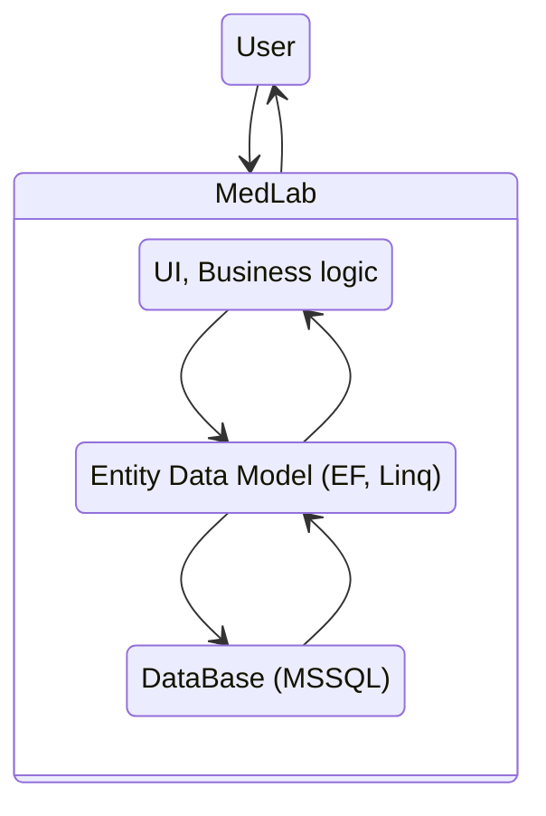

# **MedLab**

MedLab is a CRM system for optimizing the work of organizations engaged in laboratory diagnostics, which have several branches and a centralized laboratory.

The project was developed as part of a thesis (College of Information Technology)

 

## ___Technologies___ ##
MAIN:
* C#
* EntityFramework 6.2.0
* Linq
* MSSQL Server
* **Necessary packages for the WinForms to work
  
ADDITIONAL PACKEGES:
* FreeSpire.Doc 10.2.0
* sautinsoft.document 5.5.4.14
* MailKit 3.2.0
* ZXing.Net 0.16.8

 

## ___Architecture___ ##
* Monolithic architecture

## ___Functional___ ##

  

    The application have the following functionality:
  

  
* Login to the system;
* The ability to send the results to the email address specified in the record.

  

    Functionality of the registry employee:
  

* Viewing events within an organization;
* Viewing the organization 's services;
* Viewing the organization 's clients;
* Organization 's customer search;
* Adding and editing the organization's clients;
* Creation of a contract for the provision of medical services and a contract for the processing of personal data;
* View the records of a certain client for services provided by the organization;
* Creating a customer account for the organization 's services;
* When creating a record , the ability to select the date and time of sample collection;
* When creating a record, the possibility of creating a personal service based on the analyses provided by the organization;
* Creation of a patient's itinerary, which indicates the price of the service provided and contains a unique barcode record;
* The ability to view the client 's ready results;
* The ability to view the result;
* The ability to view the services provided.

  

    Functionality of a laboratory employee:
  

 
* Viewing the organization 's events;
* The ability to scan a barcode on a product containing a sample for laboratory diagnostics;
* The ability to enter the value of a unique barcode entry manually;
* The ability to select the device that reads the barcode;
* View the list of necessary laboratory diagnostic work for a specific sample;
* The ability to add results for a specific sample.

  

    Branch administrator's functionality:
  

 
* Viewing the organization 's events;
* The ability to create and delete events for registry staff, laboratory staff, and all employees;
* The ability to add new services provided by the organization;
* The ability to view the services and the analyses contained therein;
* The possibility of deleting services;
* The ability to add new analyses to both the service and the database;
* The ability to add and remove users of the system;
* Viewing system users;
* The possibility of feedback from the developer;
* The ability to restrict access rights to both a specific user and a group of users.

## ___Database___ ##

TODO - Add scheme of DB

 

## ___Common___ ##
* Create unique barcodes for analysis, read barcodes using the camera
* Document management, automatic creation of documents and analysis results
* Automatic sending of test results by mail

